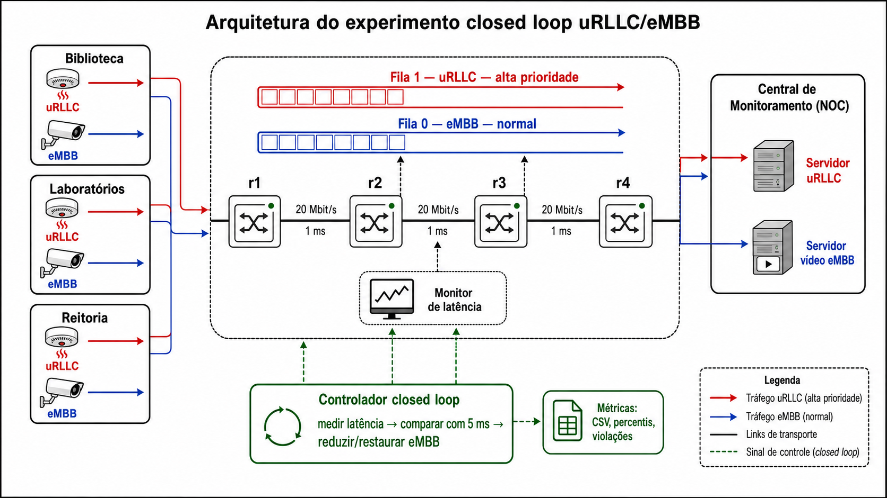

# O Emprego De Dispositivos Em Uma Rede 5G Com Closed Loop E Tráfego uRLLC/eMBB Para A Prevenção De Incêndios No Campus Da UFPB

Projeto final da disciplina **Redes de Computadores — PPGTI/IFPB**. Este
protótipo avalia um sistema de monitoramento e controle em malha fechada para
proteger aplicações uRLLC com requisito de latência one-way de até **5 ms**,
mesmo quando coexistem com tráfego eMBB de alto volume.

O cenário experimental simula um campus da **UFPB** com sensores de incêndio,
câmeras de vigilância e uma Central de Monitoramento. A instituição acadêmica
do projeto é o **IFPB**; a UFPB aparece apenas como cenário simulado.

> Os resultados representam o ambiente emulado e devem ser interpretados
> estatisticamente. Eles não constituem uma garantia de latência em uma rede 5G
> real.

## Arquitetura



*Figura 1 — Arquitetura do experimento closed loop uRLLC/eMBB em Mininet, com
Open vSwitch, filas QoS e controlador reativo.*

O laboratório possui três locais — Biblioteca, Laboratórios e Reitoria —
conectados por quatro switches Open vSwitch (`r1`–`r4`) a uma Central de
Monitoramento. Sensores geram tráfego **uRLLC TCP** com Scapy e câmeras geram
tráfego **eMBB UDP/TCP** com `iperf3`.

```text
sens_bib + cam_bib ── r1 ── r2 ── r3 ── r4 ── c_urllc + c_video
                         │      │
                  sens_lab   sens_rei
                  cam_lab    cam_rei
```

Os três enlaces do backbone têm 20 Mbit/s e 1 ms de atraso emulado. Três
fluxos eMBB de 12 Mbit/s criam contenção intencional para permitir comparação
mensurável entre as políticas.

## Estratégia de controle

O tráfego TCP na porta 5000 é classificado como uRLLC e encaminhado pela fila
de alta prioridade. Quando duas medições consecutivas excedem 5 ms, o
controlador reduz a taxa máxima das filas eMBB de 20 para 2 Mbit/s. Após três
medições normais consecutivas, a taxa é restaurada.

O eMBB permanece ativo durante a proteção; a solução não descarta todo o
tráfego de vídeo.

## Cenários avaliados

1. `isolado`: uRLLC sem eMBB;
2. `sem_qos`: uRLLC e eMBB sem classificação prioritária nem closed loop;
3. `qos_estatico`: fila prioritária fixa, sem realimentação;
4. `reativo`: fila prioritária e closed loop que reduz a taxa do eMBB sem
   interrompê-lo completamente.

Use no mínimo cinco repetições independentes por cenário e registre versão do
Docker, hardware, duração, taxa e horário da execução.

## Pré-requisitos e execução rápida

- macOS com Docker Desktop e Docker Compose v2;
- pelo menos 4 CPUs e 6 GB de memória disponíveis para o Docker;
- nenhuma instalação local de Mininet é necessária.

```bash
docker compose build
docker compose run --rm urllc-lab python3 -m unittest discover -s tests -v
docker compose run --rm urllc-lab python3 experimento.py \
  --duracao 60 --taxa-embb 12M --controle reativo
```

O Mininet depende de recursos do kernel Linux. No macOS, a solução roda em um
container privilegiado dentro da VM do Docker Desktop. O `privileged: true` é
necessário exclusivamente para criar namespaces, interfaces virtuais e regras
OVS/tc; não execute código não confiável nele.

## Bateria experimental

O comando recomendado executa cinco repetições de 60 segundos por cenário:

```bash
docker compose run --rm \
  -e REPETICOES=5 -e DURACAO=60 -e TAXA_EMBB=12M \
  urllc-lab ./executar_bateria_testes.sh
```

Para uma verificação curta com uma repetição por cenário:

```bash
docker compose run --rm \
  -e REPETICOES=1 -e DURACAO=60 -e TAXA_EMBB=12M \
  urllc-lab ./executar_bateria_testes.sh
```

## Saídas e parâmetros

Cada execução cria uma pasta em `resultados/execucoes/<cenario>/rep_XX/` com:

- `latencias_urllc.csv`: timestamp, site, sequência e latência one-way;
- `eventos_controle.txt`: ativações e desativações do controlador;
- logs do monitor, sensores e fluxos eMBB;
- resumos estatísticos e gráficos.

A bateria consolida as repetições em `resultados/comparacao_*`, mantendo os
dados brutos para auditoria e reprodução.

```text
--duracao SEGUNDOS
--taxa-embb 12M
--tipo-embb udp|tcp
--controle nenhum|reativo
--qos-estatico / --no-qos-estatico
--sem-embb
--diretorio-saida CAMINHO
```

## Guia acadêmico

Abra [`guia_relatorio.html`](guia_relatorio.html) para orientações sobre
Introdução, Metodologia, Proposta, Avaliação e Conclusões, incluindo
estratégias, tabelas, figuras e ameaças à validade. O enunciado original está
em [`PPGTI___RC___Projeto_Final.pdf`](PPGTI___RC___Projeto_Final.pdf).

## Estrutura principal

```text
.
├── README.md
├── figura_arquitetura_closed_loop.png
├── guia_relatorio.html
├── Dockerfile
├── docker-compose.yml
├── topologia.py
├── experimento.py
├── protocolo_urllc.py
├── gerador_urllc.py
├── gerador_embb.py
├── monitor_controlador.py
├── analisar_resultados.py
├── comparar_cenarios.py
├── executar_bateria_testes.sh
├── tests/
└── resultados/
```

## Limitações

- Os quatro nós OVS são uma abstração L2 do plano de encaminhamento de uma
  rede de transporte programável, não roteadores IP completos.
- Os namespaces compartilham o relógio da VM, o que viabiliza one-way delay no
  laboratório; uma implantação física exigiria sincronização PTP/NTP.
- Docker Desktop e o datapath userspace introduzem jitter adicional.
- Uma única execução serve apenas como teste funcional; conclusões
  estatísticas devem usar múltiplas repetições, percentis e taxa de violação.
