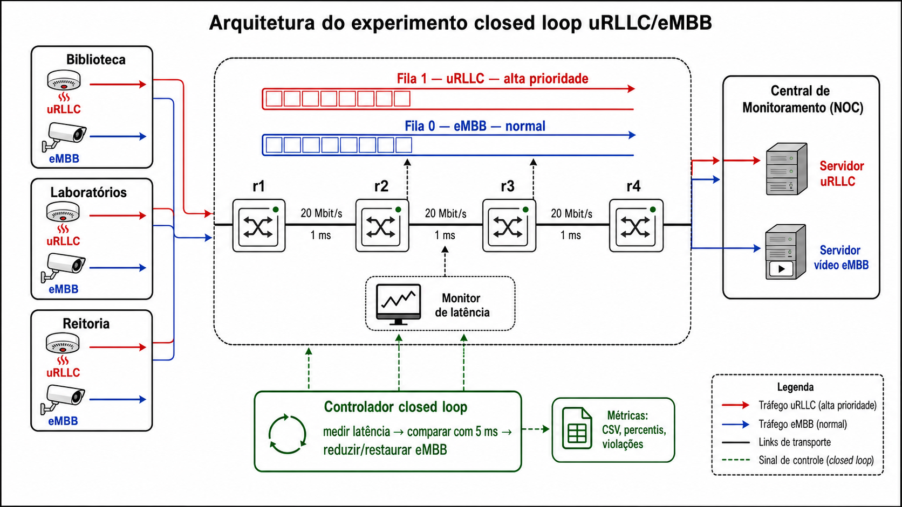

# O Emprego de Dispositivos em uma Rede 5G com Closed Loop e Tráfego uRLLC/eMBB para a Prevenção de Incêndios no Campus da UFPB

Projeto final da disciplina **Redes de Computadores — PPGTI/IFPB**. Este
protótipo avalia um sistema de monitoramento e controle em malha fechada para
proteger aplicações uRLLC com requisito de latência one-way de até **5 ms**,
mesmo quando coexistem com tráfego eMBB de alto volume.

O cenário experimental simula um campus da **UFPB** com sensores de incêndio,
câmeras de vigilância e uma Central de Monitoramento. A instituição acadêmica
do projeto é o **IFPB**; a UFPB aparece apenas como cenário simulado.

> Os resultados representam o ambiente emulado e devem ser interpretados
> estatisticamente. Eles não constituem uma garantia de latência em uma rede 5G
> real.

## Arquitetura



*Figura 1 — Arquitetura do experimento closed loop uRLLC/eMBB em Mininet, com
Open vSwitch, filas QoS e controlador reativo.*

O laboratório possui três locais — Biblioteca, Laboratórios e Reitoria —
conectados por quatro switches Open vSwitch (`r1`–`r4`) a uma Central de
Monitoramento. Sensores geram tráfego **uRLLC TCP** com Scapy e câmeras geram
tráfego **eMBB UDP/TCP** com `iperf3`.

```text
sens_bib + cam_bib ── r1 ── r2 ── r3 ── r4 ── c_urllc + c_video
                         │      │
                  sens_lab   sens_rei
                  cam_lab    cam_rei
```

Os três enlaces do backbone têm 20 Mbit/s e 1 ms de atraso emulado. Três
fluxos eMBB de 12 Mbit/s criam contenção intencional para permitir comparação
mensurável entre as políticas.

## Estratégia de controle

O tráfego TCP na porta 5000 é classificado como uRLLC e encaminhado pela fila
de alta prioridade. Quando duas medições consecutivas excedem 5 ms, o
controlador reduz a taxa máxima das filas eMBB de 20 para 2 Mbit/s. Após três
medições normais consecutivas, a taxa é restaurada.

O eMBB permanece ativo durante a proteção; a solução não descarta todo o
tráfego de vídeo.

## Cenários avaliados

1. `isolado`: uRLLC sem eMBB;
2. `sem_qos`: uRLLC e eMBB sem classificação prioritária nem closed loop;
3. `qos_estatico`: fila prioritária fixa, sem realimentação;
4. `reativo`: fila prioritária e closed loop que reduz a taxa do eMBB sem
   interrompê-lo completamente.

Use no mínimo cinco repetições independentes por cenário e registre versão do
Docker, hardware, duração, taxa e horário da execução.

## Pré-requisitos

- macOS com Docker Desktop e Docker Compose;
- pelo menos 4 CPUs e 6 GB de memória disponíveis para o Docker;
- nenhuma instalação local de Mininet, Open vSwitch ou `iperf3` é necessária;
- acesso à Internet na primeira construção da imagem, para baixar a imagem
  `ubuntu:22.04` e os pacotes do laboratório.

O projeto não possui uma suíte `unittest` separada. A validação inicial é feita
pela compilação dos scripts Python, pela exibição da ajuda do experimento e,
opcionalmente, por uma execução curta.

## Ambiente de referência

A bateria usada como referência para o artigo foi registrada em **25/07/2026**.
Os arquivos `resultados/manifesto_host.txt` e
`resultados/manifesto_experimento.txt` preservam parte desses metadados.

### Host macOS

| Item | Versão ou configuração |
|---|---|
| Computador | Mac mini (Mac16,10) |
| Processador | Apple M4, 10 núcleos (4 de desempenho e 6 de eficiência) |
| Memória física | 16 GB |
| Arquitetura | arm64 |
| Sistema operacional | macOS 26.5.2, build 25F84 |
| Docker Desktop | 4.83.0 |
| Docker Engine | 29.6.2 |
| Docker Compose | v5.3.1 |
| Recursos informados pelo Docker | 10 CPUs e aproximadamente 7,75 GiB de memória |

### Container do laboratório

O Mininet não é executado diretamente no kernel Darwin. Ele roda em um
container Linux privilegiado, dentro da VM Linux do Docker Desktop, usando o
datapath `netdev` do Open vSwitch.

| Componente | Versão ou configuração |
|---|---|
| Sistema operacional | Ubuntu 22.04.5 LTS |
| Kernel da VM | LinuxKit 6.12.76-linuxkit |
| Arquitetura | aarch64 |
| Python | 3.10.12 |
| Mininet | 2.3.0 |
| Open vSwitch | 2.17.9 |
| `iperf3` | 3.9 (cJSON 1.7.13) |
| Scapy | 2.7.0 |
| NumPy | 2.2.6 |
| SciPy | 1.15.3 |
| Matplotlib | 3.10.7 |

Para registrar as versões do ambiente antes de uma nova execução, use:

```bash
sw_vers
system_profiler SPHardwareDataType \
  | grep -E 'Model Name|Model Identifier|Chip|Total Number of Cores|Memory'
docker compose version
docker version
docker info --format 'Server={{.ServerVersion}} OS={{.OperatingSystem}} Arch={{.Architecture}} CPUs={{.NCPU}} Memory={{.MemTotal}}'
docker compose run --rm --entrypoint bash urllc-lab -lc '
  . /etc/os-release
  printf "%s\\n" "$PRETTY_NAME"
  uname -r
  python3 --version
  mn --version
  ovs-vswitchd --version | head -n 1
  iperf3 --version | head -n 1
  python3 -c "import matplotlib, numpy, scipy, scapy; print(\"Scapy\", scapy.__version__); print(\"NumPy\", numpy.__version__); print(\"SciPy\", scipy.__version__); print(\"Matplotlib\", matplotlib.__version__)"
'
```

O Mininet depende de recursos do kernel Linux. No macOS, a solução roda em um
container privilegiado dentro da VM do Docker Desktop. O `privileged: true` é
necessário exclusivamente para criar namespaces, interfaces virtuais e regras
OVS/tc; não execute código não confiável nele.

## Bateria experimental

### Verificação rápida

Construa a imagem e valide os scripts sem iniciar uma bateria completa:

```bash
docker compose build
docker compose run --rm --entrypoint bash urllc-lab -lc \
  'python3 -m compileall -q /app/*.py && python3 experimento.py --help'
```

Para um teste funcional curto, execute uma repetição de 10 segundos em cada
cenário:

```bash
docker compose run --rm \
  -e REPETICOES=1 -e DURACAO=10 -e TAXA_EMBB=12M \
  urllc-lab ./executar_bateria_testes.sh
```

### Teste individual de um cenário

Cada comando abaixo executa uma repetição de 60 segundos e grava os arquivos
no diretório montado `resultados/` do host. Use `--duracao 10` para um teste
funcional mais rápido.

```bash
# 1. Isolado: somente uRLLC, sem tráfego eMBB.
docker compose run --rm urllc-lab python3 experimento.py \
  --duracao 60 --taxa-embb 12M --sem-embb --controle nenhum \
  --qos-estatico --diretorio-saida /app/resultados/manual/isolado

# 2. Sem QoS: uRLLC e eMBB concorrentes, sem fila prioritária.
docker compose run --rm urllc-lab python3 experimento.py \
  --duracao 60 --taxa-embb 12M --controle nenhum --no-qos-estatico \
  --diretorio-saida /app/resultados/manual/sem_qos

# 3. QoS estático: fila prioritária fixa, sem closed loop.
docker compose run --rm urllc-lab python3 experimento.py \
  --duracao 60 --taxa-embb 12M --controle nenhum --qos-estatico \
  --diretorio-saida /app/resultados/manual/qos_estatico

# 4. Closed loop reativo: QoS estático mais ajuste automático do eMBB.
docker compose run --rm urllc-lab python3 experimento.py \
  --duracao 60 --taxa-embb 12M --controle reativo --qos-estatico \
  --diretorio-saida /app/resultados/manual/reativo
```

Os parâmetros disponíveis em `experimento.py` são:

```text
--duracao SEGUNDOS
--taxa-embb TAXA              # exemplo: 12M por fluxo
--tipo-embb udp|tcp
--controle nenhum|reativo
--sem-embb
--intervalo-urllc SEGUNDOS    # padrão: 0.1
--qos-estatico / --no-qos-estatico
--diretorio-saida CAMINHO
```

### Bateria completa

O comando recomendado executa cinco repetições de 60 segundos por cenário,
totalizando 20 execuções independentes:

```bash
docker compose run --rm \
  -e REPETICOES=5 -e DURACAO=60 -e TAXA_EMBB=12M \
  urllc-lab ./executar_bateria_testes.sh \
  2>&1 | tee resultados/bateria_$(date +%Y%m%d_%H%M%S).log
```

O script executa automaticamente os cenários `isolado`, `sem_qos`,
`qos_estatico` e `reativo`, chama `comparar_cenarios.py` e, ao final,
executa `analisar_evidencias.py`.

Também é possível alterar os parâmetros sem editar os scripts:

```bash
docker compose run --rm \
  -e REPETICOES=5 -e DURACAO=60 -e TAXA_EMBB=8M \
  urllc-lab ./executar_bateria_testes.sh
```

O parâmetro `TAXA_EMBB` representa a taxa de **cada** um dos três fluxos
eMBB. A topologia mantém 20 Mbit/s nos enlaces do backbone; portanto, três
fluxos de 12 Mbit/s geram contenção intencional.

## Saídas e parâmetros

Cada execução cria uma pasta em `resultados/execucoes/<cenario>/rep_XX/` com:

- `latencias_urllc.csv`: timestamp, site, sequência e latência one-way;
- `eventos_controle.txt`: ativações e desativações do controlador;
- logs do monitor, sensores e fluxos eMBB;
- resumos estatísticos e gráficos.

A bateria consolida as repetições em `resultados/comparacao_*`, incluindo a
ECDF comparativa, mantendo os dados brutos para auditoria e reprodução.

Ao final da bateria, os scripts de consolidação geram:

- `metricas_urllc.csv` e `metricas_urllc_tabela.txt`: tentativas, sucessos,
  timeouts, violações acima de 5 ms e não conformidade efetiva;
- `metricas_urllc.png`: perdas/timeouts e não conformidade por cenário;
- `vazao_embb.csv` e `vazao_embb_tabela.txt`: vazão recebida e perda UDP
  extraídas das linhas finais do iperf3;
- `vazao_embb.png`: comparação da vazão eMBB com IC 95% entre repetições.
- `manifesto_experimento.txt`: duração, taxa e repetições, além da versão do
  Python e do kernel LinuxKit observado no container. Esse arquivo é escrito
  por `executar_bateria_testes.sh` no início da bateria;

O `manifesto_host.txt` é o registro do macOS, Docker, hardware e data da
bateria. Ele deve ser atualizado no host quando uma nova máquina ou
configuração do Docker for utilizada.

As mensagens uRLLC que expiram o timeout são contabilizadas como tentativas
não conformes, mesmo que não apareçam no CSV de latência recebida.

## Estrutura principal

```text
.
├── README.md
├── figura_arquitetura_closed_loop.png
├── guia_relatorio.html
├── Dockerfile
├── docker-compose.yml
├── topologia.py
├── experimento.py
├── protocolo_urllc.py
├── gerador_urllc.py
├── gerador_embb.py
├── monitor_controlador.py
├── analisar_resultados.py
├── analisar_evidencias.py
├── comparar_cenarios.py
├── executar_bateria_testes.sh
├── tests/
└── resultados/
```

## Limitações

- Os quatro nós OVS são uma abstração L2 do plano de encaminhamento de uma
  rede de transporte programável, não roteadores IP completos.
- Os namespaces compartilham o relógio da VM, o que viabiliza one-way delay no
  laboratório; uma implantação física exigiria sincronização PTP/NTP.
- Docker Desktop e o datapath userspace introduzem jitter adicional.
- Uma única execução serve apenas como teste funcional; conclusões
  estatísticas devem usar múltiplas repetições, percentis e taxa de violação.
